+++
authors = ["Nathaniel Roberts"]
title = "Capture the Flag - 1"
date = "2024-06-13"
description = "This is a list of 4 portfolios I completed while finishing a Data Science Course at Macquarie University"
+++
# CTF #1 Penetration Test Report

**Report by: Nathaniel Roberts**

**September 5 , 2023**

## Table of	Contents
- [CTF #1 Penetration Test Report](#ctf-1-penetration-test-report)
  - [Table of	Contents](#table-ofcontents)
  - [1 Report Overview](#1-report-overview)
    - [1.1 Executive Summary](#11-executive-summary)
    - [1.2 Engagement Overview](#12-engagement-overview)
    - [1.3 Scope of Engagement](#13-scope-of-engagement)
  - [2 Technical Findings](#2-technical-findings)
    - [Technical Findings](#technical-findings)
    - [2.1 Lack Of Admin Authentication](#21-lack-of-admin-authentication)
      - [2.1.1 Critical Risk](#211-critical-risk)
    - [2.2 Lack of File Security](#22-lack-of-file-security)
      - [2.2.1 High Risk](#221-high-risk)
    - [2.3 Lack of Process Termination](#23-lack-of-process-termination)
      - [2.3.1 High Risk](#231-high-risk)
    - [2.4 Unfinished Challenge](#24-unfinished-challenge)
      - [2.4.1 Low Risk](#241-low-risk)
  - [3 Ethics and Reflection](#3-ethics-and-reflection)
    - [3.1 Ethics](#31-ethics)
    - [3.2 Reflection](#32-reflection)
  - [4 Team](#4-team)
  - [5 Conclusion](#5-conclusion)
  - [6 Appendices](#6-appendices)
    - [6.1 Tools](#61-tools)


## 1 Report Overview

### 1.1 Executive Summary

Team 244 is made up of 3 members, each with experienced knowledge in the land of penetration
testing. The three members are; Nathaniel Roberts, *Redacted*, and *Retacted*. Macquarie
University contacted Team 244 to organize and deliver a Penetration Test. The goal of this
Penetration Test is to identify vulnerabilities and security issues within their technological
infrastructure. This report outlines and includes the details of this arrangement, including
recommended remediations, to improve the security of the infrastructure.

Macquarie University setup a virtual network, in which Team 244 was able to operate and try and
source vulnerabilities to find sensitive information, in this case, flags. There were 5 possible
vulnerabilities to try and exploit in a limited time period of 48 hours. This report discusses the
process and findings of four of the five. Due to the short time frame for the attacks, not all of the
flags were discovered. Only 3 of the flags were able to be found and exploited.

This report contains a Report Overview. This section will contain an executive summary of the
findings as well as information regarding the scope and the engagement. The next section contains
the Technical Findings. This section discusses in detail each discovered vulnerability as well as the
processes to achieving the attack. It will also include a section on how to improve the security of the
system to prevent attacks from malicious actors. This report will then end with a conclusion,
followed by appendices regarding the tools used.

During this Capture the Flag, a total of **3** vulnerabilities were found in Macquarie University’s
network. In terms of severity, **1** vulnerability is critical, **1** vulnerability is high, and **1** vulnerability is
moderate. Many of the vulnerabilities in the environment are due to improper authentication,
processes not being killed correctly, or not applying principles of least privileges. More information
about these vulnerabilities can be found in Section 2.


### 1.2 Engagement Overview

Team 244 conducted the Capture the Flag on Macquarie University’s servers between the dates of
the 28 th of August to the 29th of august. The focus and the rules of the engagement are as followed:

_-_ The CTF is an open-book, group based practical exam,
_-_ Teamwork is part of the exam and is strongly encouraged
_-_ You must not collaborate with anyone outside of your own team
_-_ Anyone caught communicating with members or another team, or anyone outside the unit, will
    be disciplined for plagiarism (you have been warned)
_-_ The goal is to find as many flags as possible, by finding vulnerabilities in systems and/or web-facing
    servers.

### 1.3 Scope of Engagement

The scope of this Capture the Flag was limited to access to one Kali Instance on the server, and
the following addresses:

- 10.244.1.
- 10.244.1. 20
- 10.244.1. 30
- 10.244.1. 40
- 10.244.1. 50

The Capture the Flag was conducted with caution to guarantee that actions taken were not outside
of the agreed upon address list. This included not jeopardizing other teams in the challenge by
interfering with their virtual machine instances. Because the exam was conducted in a virtualized
environment, there was no risk of disrupting services.

All tasks conducted are written up and detailed in this report.


## 2 Technical Findings

### Technical Findings

The table below shows the total number of vulnerabilities found during the capture the flag. The vulnerabilities are categorized based on the risk level. The risk levels were calculated using the Common Vulnerability Scoring System (CVSS).

**Risk Level and Total Number of Discovered Vulnerabilities**

| Severity | Low (0.1-3.9) | Moderate (4.0-6.9) | High (7.0-8.9) | Critical (9.0-10.0) |
| --- | --- | --- | --- | --- |
| Vulnerability Count | 0   | 0   | 2   | 1   |

The following table breaks down the discovered vulnerabilities by overall risk score, im- pact, and exploitability. The scores were calculated using NIST’s CVSS v3.1 calculator.

**Summary of Vulnerabilities by Base Score**

| **Risk Summary** | **Overall Risk Score** | **Impact** | **Exploitability** |
| --- | --- | --- | --- |
| Lack of Web Authentication | 9   | 8   | 10  |
| Lack of File Authentication | 7.5 | 5   | 10  |
| Lack of Process Control | 7.2 | 5   | 10  |
| Unknown |     |     |     |


### 2.1 Lack Of Admin Authentication

#### 2.1.1 Critical Risk

**Threat Level** : Critical (9.5)

**Description** :
The first Capture the Flag Challenge was the Sunlight Zone Challenge, “Bot Spray”. This challenge was a
web-based exploit. The hint that was provided was: “Keeping the creepy-crawlies out”.


**Planning and Reconnaissance** :
To begin this Challenge, I browsed to the supplied IP Address (10.244.1.10), to look at the site. The site’s
front facing page can be seen in Figure 1.

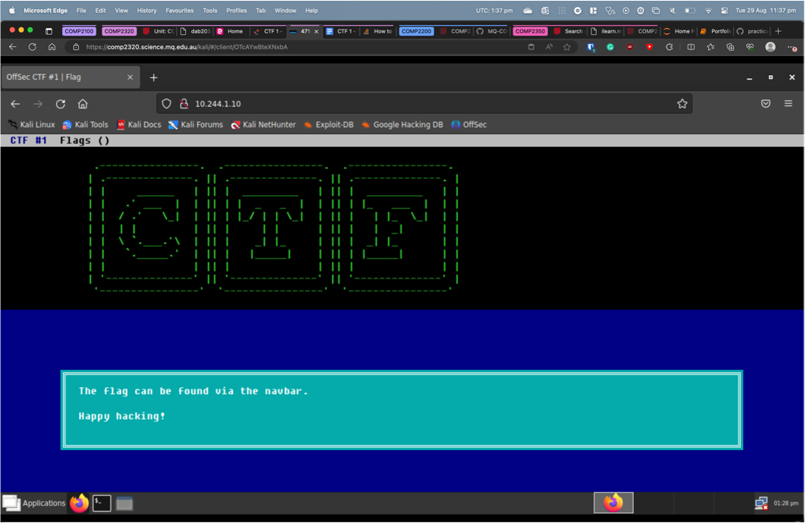
```
Figure 1 : 10.244.1.10 Home Page
```

The page had the instructions to use the Nav Bar to find the flag. SO navigating through the page. I selected
the “Flag()” in the nav bar. This had a dropdown with “Flag” as an option. Upon clicking this, I got the
following page in Figure 2.

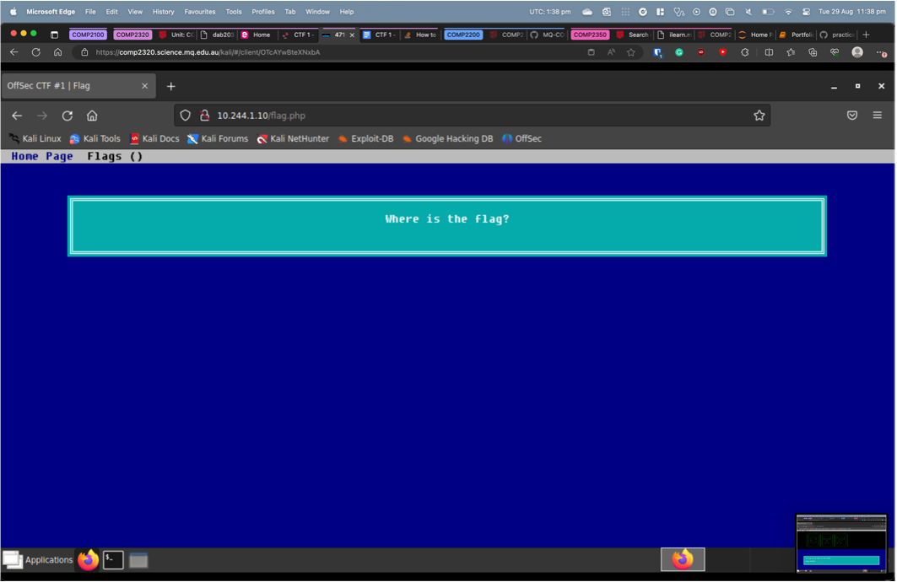
```
Figure 2 : 10.244.1.10 Flag Page
```
To gain more information, we viewed the source code to see if there was anything that stuck out, or if there
were any hidden files or comments. Nothing unusual was found.

We also viewed the network requests to see if any interesting servers were being reached. The page reached
out to a “js” and a “css” index. We noted this down for late investigation. We didn’t find any other requests
that were unusual or could contain information.

After going through the site, trying to gain as much information as possible, we decided to consider the
hint that was given, “Keeping the creepy-crawlies out”. Our initial thought was that this related to web
crawlers, and the best way to them out is to Disallow them in the “robots.txt” file on the page. Figure 3
shows that the only site that was disallowed was /admin. We then navigated to this page and saw a page
saying we weren’t authorised to view this page, see Figure 4. We decided to start our Exploitation at this
point.

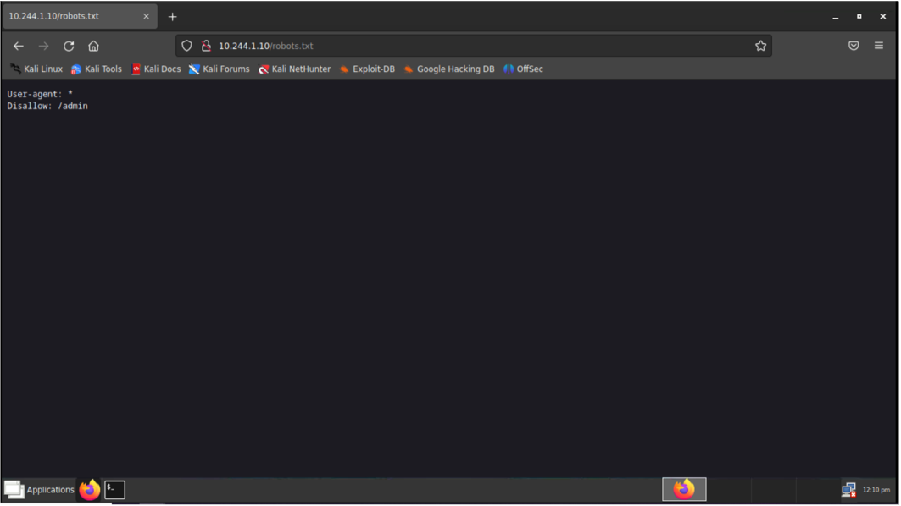
```
Figure 3 : 10.244.1.10 Robots.txt Page
```
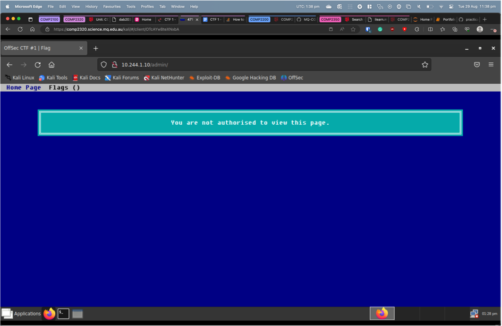
```
Figure 4 : 10.244.1.10 Admin Page
```
**Gaining Access And Exploitation** :

The first step was to install burp suite, “apt install burpsuite”. This program lets us intercept requests and
change the headers. So we tried navigating to the /admin page and then changing the headers to see what
we would get back. We changed the Host, User-Agent and Referer Headers, for the following pages.

- 10.244.1.
- 10.244.1.10/admin/


- 10.244.1.10/flag.php
- 10.244.1.10/js/
- 10.244.1.10/css/

No matter what the host was changed to, the response was always “400: Bad Request”, we tried the
following User-Agents.

- Httpful/0.2.20 (cURL/7.35.0 PHP/5.5.9-1ubuntu4.17 (Linux) Apache/2.4.7 (Ubuntu) Mozilla/5.
    (Windows NT 10.0; Win64; x64) AppleWebKit/537.36 (KHTML, like Gecko) Chrome/90.0.4430.
    Safari/537.36 Edg/90.0.818.46)
- Apache/2.4.7 (Ubuntu) mod_auth_pgsql/2.0.3 PHP/5.5.9-1ubuntu4.12 OpenSSL/1.0.1f
- Apache/2.4.7 (Ubuntu)PHP/5.5.9-1ubuntu4.

We also tried the following Referers:

- [http://10.244.1.10/flag.php](http://10.244.1.10/flag.php)
- [http://10.244.1.10/js](http://10.244.1.10/js)
- [http://10.244.1.10/admin/](http://10.244.1.10/admin/)

None of this returned anything helpful. The next train of thought was to try using the “WFUZZ” tool. This
would allow us to try and brute force some authentication methods on different pages. The following is the
list of commands we used.

- wfuzz -z range,0-10 [http://10.244.1.10/user=FUZZ](http://10.244.1.10/user=FUZZ)
- wfuzz -z range,0- 10 [http://10.244.1.10/flag.php?user=FUZZ](http://10.244.1.10/flag.php?user=FUZZ)
- wfuzz -z range,0- 10 [http://10.244.1.10/admin?user=FUZZ](http://10.244.1.10/admin?user=FUZZ)
- wfuzz -z file,/usr/share/wfuzz/wordlist/others/common_pass.txt - z
    file,/usr/share/wfuzz/wordlist/others/common_pass.txt -d
    “username=FUZZ&password=FUZ2Z” [http://10.244.1.10/flag.php](http://10.244.1.10/flag.php)
- wfuzz -z file,/usr/share/wfuzz/wordlist/others/common_pass.txt -z
    file,/usr/share/wfuzz/wordlist/others/common_pass.txt -d
    “username=FUZZ&password=FUZ2Z” [http://10.244.1.10/admin/](http://10.244.1.10/admin/)

None of this returned any helpful information. This meant that we had yet to find a way to brute force the
authentication page.


It was at this moment, we realized we might have missed something during our original information
gathering and page scope. So we decided to use the “Gobuster” tool to see if we could build more of a site
map and find pages that we hadn’t found originally.

We decided to test the home page first. So we used the following command, “gobuster dir -u
[http://10.244.1.10/](http://10.244.1.10/) -w /usr/share/wordlists/dirb/common.txt”, to brute force possible page indexes using the
Dirb Wordlist “common.txt”. This returned the following.

- /.hta (Status:403) [Size: 282]
- /.htpasswd(Status: 403) [Size: 287]
- /.htaccess(Status: 403) [Size: 287]
- /admin(Status: 301) [Size: 309][-->http://10.244.1.10/admin/]
- /css (Status:301) [Size: 307] [-->http://10.244.1.10/css/]
- /index.html(Status: 200) [Size:2026]
- /js (Status:301) [Size: 306] [-->http://10.244.1.10/js/]
- /robots.txt(Status: 200) [Size: 31]
- /server-status(Status: 403) [Size: 291]

The only pages found during this was pages we had already discovered.

Next step was to try the same thing on the “10.244.1.10/admin/ page. We used the following command,
“gobuster dir -u [http://10.244.1.10/admin](http://10.244.1.10/admin) - w /usr/share/wordlists/dirb/common.txt”. The following was the
results returned.

- /.hta (Status:403) [Size: 288]
- /.htpasswd (Status: 403) [Size: 293]
- /.htaccess (Status: 403) [Size: 293]
- /index.php (Status: 200) [Size:1241]
- /index.html(Status: 200) [Size:1239]

The pages “10.244.1.10/admin.index.php” and “10.244.1.10/admin.index.html”, were new pages. Since they
returned a Status Code of 200. We knew they were reachable sites. So we checked them both out.

The page “10.244.1.10/admin.index.php”, returned contained the text “The flag is


**ac46bdf983905489970b6535505a424e** ”. See Figure 5.
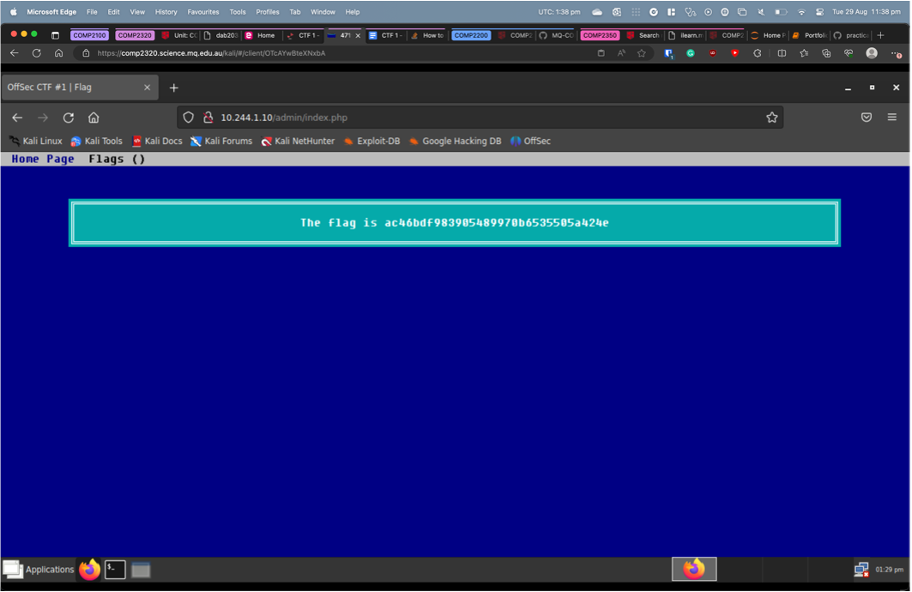
```
Figure 5 : 10.244.1.10 Admin/Index.php Page
```
**Business Impact and Recommended Remediation** :
The page containing the flag should have authentication on it, since it is in the file path /admin/. This
is a massive vulnerability, as anyone can access the page with sensitive information on it. The
recommended fix is to add authentication to all pages under the /admin/ directory. This can be done
with Authentication headers or using the Cookie header. This will only allow authenticated users to
access the sites and therefore increasing security.

**References** :
[http://www.robotstxt.org/robotstxt.html](http://www.robotstxt.org/robotstxt.html)


### 2.2 Lack of File Security

#### 2.2.1 High Risk

**Threat Level** : High (7.5)

**Description** :
The Second Capture the Flag Challenge was the Sunlight Zone Challenge, “Manual Labour”. This
challenge was a system-based exploit. The hint that was provided was: “Four on the floor or three on the
tree”.

**Planning and Reconnaissance** :

To begin this challenge we used telnet to gain access to the address “ 10 .244.1.20”. We used the “guest”
credentials to login. We started by navigating and exploring the file system, to see if there was anything
that stood out. We used the commands “ls” and “cd” and “cat” to discover directories and files and open
them and try and find possible hints. Nothing was found. We then considered the name of the challenge,
being “Manual Labour”. We decided that this meant man pages. So we continued searching the file system,
hoping to see something stick out. When searching through the files, we found in the /usr/share directory,
a folder named “man”. We viewed the contents of this directory using “ls” and saw a list of folders all with
man in the title, see Figure 6.
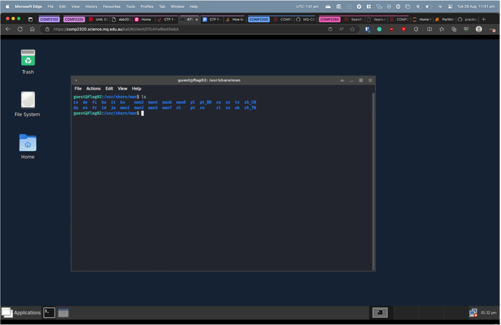
```
Figure 6 : 10.244.1. 20 /usr/share/man Directory
```
**Gaining Access And Exploitation** :

We decided this would be the best place to start an exploit. So we started sorting through the
directory.

Because of the hint, “Four on the floor or three on the tree”, we decided to search the “man3” and
the “man4” directories. You can find their contents in Figure 7 and Figure 8.

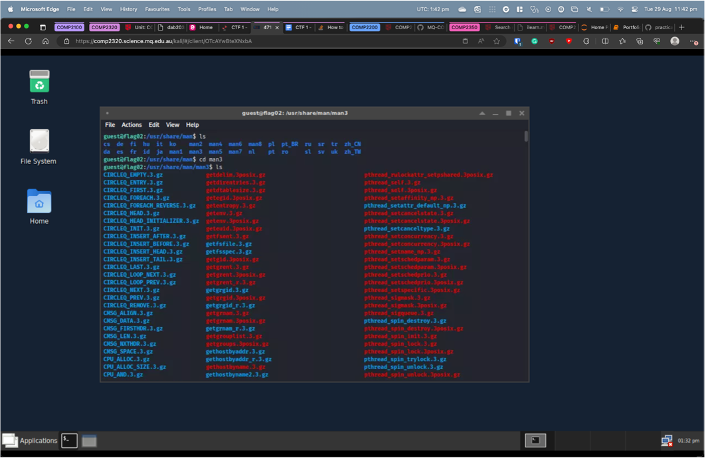
```
Figure 7 : 10.244.1. 20 /usr/share/man/man3 Directory
```
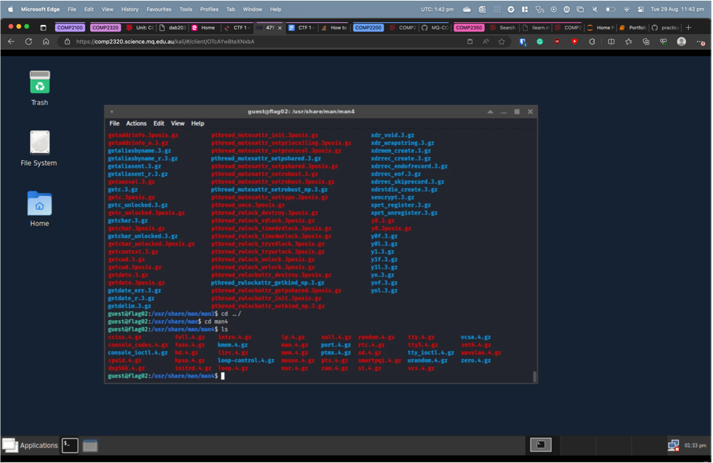
```
Figure 8 : 10.244.1. 20 /usr/share/man/man4 Directory
```
The contents of “man4” seemed more promising with the “man4.gz” file. Because this file has been
compressed, we used “gunzip -dc man4.gz” to extract the file. You can see the results in Figure 9.

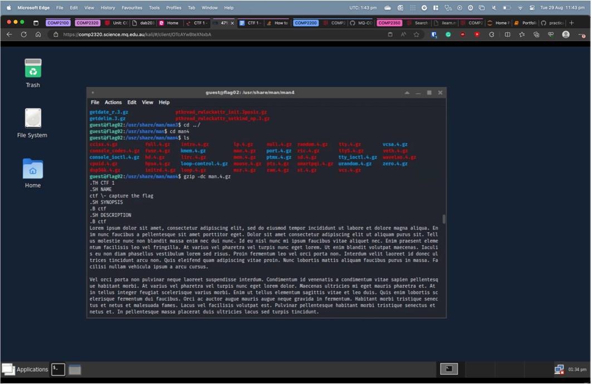
```
Figure 9 : 10.244.1. 20 man4 file contents
```
The beginning of the file says “Capture the Flag”, so we further investigated the file. Further down we find
text saying, “Four on the floor”, followed by what looks like a flag. Since this is part of the hint, we decided
to test the flag. It was correct. The flag is “ **314157e25dc53f0891b235df77a07016** ”, see Figure 10.
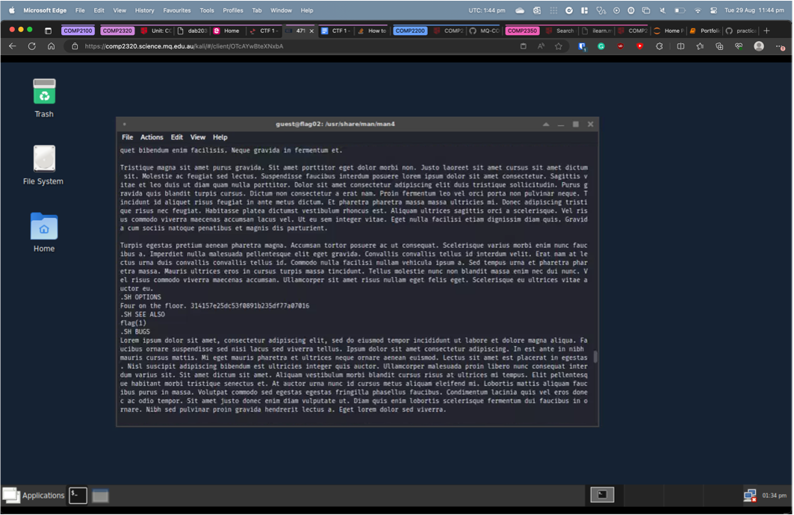
```
Figure 10 : 10.244.1. 20 man4 file contents/flag
```
**Business Impact and Recommended Remediation** :

The file system contained files in directories that had incorrect user access. Files containing important
information, should only be readable by users with correct privileges. To prevent this being exploited


in the future, we recommend setting permissions on your files, that only allow authorized users to
access the files.

**References** :

https://www.quora.com/What-is-four-on-the-floor


### 2.3 Lack of Process Termination

#### 2.3.1 High Risk

**Threat Level** : High (7. 1)

**Description** :
The Third Capture the Flag Challenge was the Twilight Zone Challenge, “Infinite Dreams”. This challenge
was a system-based exploit. The hint that was provided was: “Not dead, but only sleeping”.

**Planning and Reconnaissance** :

To begin this challenge we used telnet to gain access to the address “ 10 .244.1. 30 ”. We used the “guest”
credentials to login. We started by navigating and exploring the file system, to see if there was anything
that stood out. We used the commands “ls” and “cd” and “cat” to discover directories and files and open
them and try and find possible hints. We decided to investigate what the hint could possibly mean. We
started doing some research and found that we could check process states and if they were dead. To view
this we used the command “ps axu” see Figure 11.
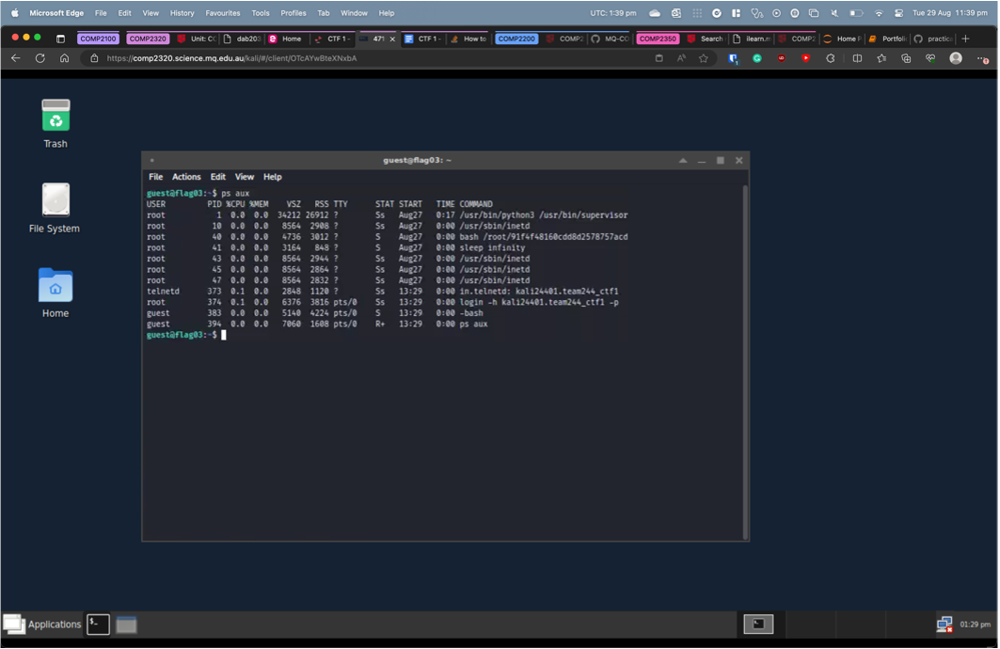
```
Figure 11 : 10.244.1. 30 “ps aux”
```
The Process being run by PID 41 was called “Sleep Infinity”, which we though related very precisely to
both the hint, “Not dead, but only sleeping” and the name “Infinite Dreams”. So we decided to move ahead
on this route.

**Gaining Access And Exploitation** :

We first thought that we should try to kill the command and put it into a dead state. We tried a large variety
of methods. We tried:


- “kill 41”
- Kill -9 41”
- Killall sleep”

We also tried the “top” command, which works similar to “ps aux” and shows all processes. In this menu
we could kill the processes by typing “k”, followed by the process “ 41 ” and then “ 9 ” to kill it. All of these
commands returned with permissions denied.

We then started to do more research into sleeping processes and we found that the state “S” means sleep.
We decided to take a look at all the processes again, and we found a second process, PID 40, which was also
in a sleep state. See Figure 10. This was running the command bash /root/
91f4f48160cdd8d2578757acd15e972d. We assumed this was the flag, and it was The third flag is
**91f4f48160cdd8d2578757acd15e972d.**

**Business Impact and Recommended Remediation** :
We were able to discover this flag because there were sleeping processes that hadn’t been killed. If a
process doesn’t need to be running, it is useful to kill it. This way it isn’t using memory or allowing
malicious actors to view all the commands your Unix System is running.
If these “Sleeping” process had been properly killed, the flag wouldn’t have been found.

**References** :
https://itslinuxfoss.com/process-state-x-dead/
https://stackoverflow.com/questions/32418718/how-to-see-the-process-table-in-unix
https://unix.stackexchange.com/questions/252507/how-can-i-wake-a-process-from-sleep-status-via-
signal-or-proc


### 2.4 Unfinished Challenge

#### 2.4.1 Low Risk

**Threat Level** : Unknown

**Description** :
The Fourth Capture the Flag Challenge was the Twighlight Zone Challenge, “Epoch”. This challenge was
a file-based exploit. The hint that was provided was: “Time Travel is Possible”.

**Planning and Reconnaissance** :

To begin this challenge we used telnet to gain access to the address “ 10 .244.1. 40 ”. We used the “guest”
credentials to login. We started by navigating and exploring the file system, to see if there was anything
that stood out. We used the commands “ls” and “cd” and “cat” to discover directories and files and open
them and try and find possible hints. We found that the /home/ directory had a long list of users, each with
a flag.txt file. We used “find. -name ‘flag.txt’ - exec cat {} \;” Permission to access was denied for all files.

We decided to investigate what the hint could possibly mean. After some research we stumbled across the
year 2038 problem and the Epochalypse. We then found a text file named “timestap.txt” the contents of this
file were “3 FEB 2611, 01:55:12.109”

No more progress was made, as the challenge had concluded.

**References** :
https://en.wikipedia.org/wiki/Year_2038_problem
https://www.epochconverter.com/
https://www.cyberciti.biz/faq/howto-set-date-time-from-linux-command-prompt/


## 3 Ethics and Reflection

### 3.1 Ethics

When it comes to penetration tests, there is a whole world of ethics to consider. You can only act within
the scope of engagement (talked about in Section 1.3). Without following this strict guideline, you are
participating in unethical hacking. You also need to be transparent with all vulnerabilities found, which
are detailed in Section 2 of this report.

You are also bound by a strict confidentiality agreement. All data and information found within the scope
of the Penetration Test, can only be shared with authorized parties and individuals. There is therefore a
duty to protect and secure all data and information found during the engagement.

During this CTF, all information found has been detailed in this report to ensure full transparency of
actions. We also stuck to the scope and didn’t interfere with other teams attempting this challenge.

### 3.2 Reflection

This Capture the Flag was an amazing opportunity to dive deep into the world of ethical hacking. This
was my first CTF and I thoroughly enjoyed it. There was a slight learning curve into the nature of these
challenges and learning how CTFs function was a vital part of this curve. Once this had been achieved, I
dove head first into the challenges and a wide range of skills that will be useful in both my career and
future CTFs. I learnt that sometimes the easiest solutions are the right solutions. A lot of the tasks we
spent lots of time over complicating the problem we faced, and if we just stepped back to look at it, we
would have arrived at the solution a lot quicker.

## 4 Team

I was very fortunate to be a part of a team in which everyone gave there all. We all reached an
understanding of individual and group work. We would split up on separate challenges, tackling them on
our own to spread the load. We would then discuss problems or ideas with each other to see if there were
any obvious mistakes we were making. If we got stuck on a flag for too long, we would fill in a team
member and swap with them, to bring a fresh pair of eyes to the challenge. We would also meet up and
work on the same flag together if we reached a real challenge. Altogether, the team worked amazing
together and achieved the completion of 3 out of the 5 flags.


## 5 Conclusion

This concludes the Penetration Test report conducted by Team244 on the 28 th- 29 th of August 2023.

The security vulnerabilities that were found included, improper web authentication, improper file
authentication, and improper handling of sleeping processes. We hope the recommendations in
this report allow Macquarie University to better secure their CTF’s for future attacks.

This CTF challenge proved to be both fun and challenging and we look forward to further
business with Macquarie University in the near future.


## 6 Appendices

### 6.1 Tools

| **Name** | **Description** | **Link** |
| --- | --- | --- |
| Nmap | Network and vulnerability scanner | <https://nmap.org/> |
| Curl | URL Manipulation Tool | <https://github.com/curl/curl> |
| DIRB | Directory Brute Force Tool | <https://github.com/v0re/dirb> |
| Gobuster | Directory Brute Force Tool | <https://github.com/OJ/gobuster> |
| Burp Suite | Web Request Manipulation Tool | <https://portswigger.net/burp> |
| wFuzz | Web Application Fuzzer | <https://github.com/xmendez/wfuzz> |


